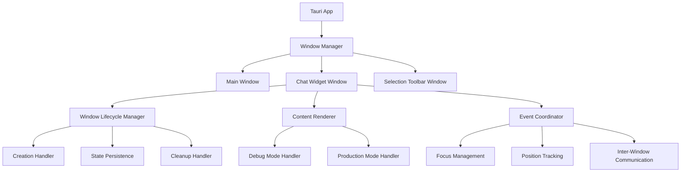

# Design Document: Floating Window Fixes

## Overview

This design addresses critical issues with the Cognia desktop application's floating AI assistant window. The current implementation suffers from content visibility problems, improper debug mode sizing, and multi-window management issues. The solution involves refactoring the Tauri window management system, improving content rendering reliability, and implementing proper window lifecycle management.

The key insight from research is that Tauri transparency issues often require specific handling - using opaque backgrounds for content visibility while maintaining proper window styling. Additionally, multi-window applications need careful coordination of window states and proper resource management.

## Architecture

### Current Architecture Issues

The existing system has several architectural problems:

1. **Transparency Conflicts**: The current implementation uses `transparent: false` but may still have rendering issues due to CSS backdrop effects conflicting with native window properties
2. **Inconsistent Sizing Logic**: Debug mode sizing is handled at window creation but doesn't account for dynamic development tool requirements
3. **Window State Management**: The current `ChatWidgetWindow` manager lacks proper lifecycle coordination with other windows
4. **Resource Cleanup**: Insufficient cleanup when windows are destroyed or hidden

### Proposed Architecture



## Components and Interfaces

### Enhanced ChatWidgetWindow Manager

The core window manager will be enhanced with better lifecycle management:

```rust
pub struct ChatWidgetWindow {
    app_handle: AppHandle,
    window_state: Arc<RwLock<WindowState>>,
    lifecycle_manager: WindowLifecycleManager,
    content_renderer: ContentRenderer,
    event_coordinator: EventCoordinator,
}

pub struct WindowState {
    is_visible: bool,
    position: Option<(i32, i32)>,
    size: (f64, f64),
    config: ChatWidgetConfig,
    creation_mode: CreationMode,
}

pub enum CreationMode {
    Debug { min_width: f64, min_height: f64 },
    Production { width: f64, height: f64 },
}
```

### Window Lifecycle Manager

Handles the complete window lifecycle with proper error handling:

```rust
pub struct WindowLifecycleManager {
    app_handle: AppHandle,
    cleanup_handlers: Vec<Box<dyn Fn() + Send + Sync>>,
}

impl WindowLifecycleManager {
    pub fn create_window(&self, config: &WindowCreationConfig) -> Result<Window, WindowError>;
    pub fn ensure_window_exists(&self) -> Result<(), WindowError>;
    pub fn destroy_window(&self) -> Result<(), WindowError>;
    pub fn register_cleanup_handler<F>(&mut self, handler: F) 
    where F: Fn() + Send + Sync + 'static;
}
```

### Content Renderer

Manages content rendering with mode-specific optimizations:

```rust
pub struct ContentRenderer {
    mode: RenderMode,
    styling_config: StylingConfig,
}

pub enum RenderMode {
    Debug {
        enable_dev_tools: bool,
        show_performance_overlay: bool,
    },
    Production {
        optimize_rendering: bool,
    },
}

pub struct StylingConfig {
    background_opacity: f64,
    use_native_decorations: bool,
    enable_shadow: bool,
    blur_behind: bool,
}
```

### Event Coordinator

Coordinates events between multiple windows:

```rust
pub struct EventCoordinator {
    app_handle: AppHandle,
    active_windows: Arc<RwLock<HashMap<String, WindowInfo>>>,
}

pub struct WindowInfo {
    label: String,
    window_type: WindowType,
    focus_priority: u8,
    last_interaction: Instant,
}

pub enum WindowType {
    Main,
    ChatWidget,
    SelectionToolbar,
    Settings,
}
```

## Data Models

### Enhanced Window Configuration

```rust
#[derive(Debug, Clone, Serialize, Deserialize)]
pub struct ChatWidgetConfig {
    // Display settings
    pub width: f64,
    pub height: f64,
    pub min_width: f64,
    pub min_height: f64,
    
    // Position settings
    pub x: Option<i32>,
    pub y: Option<i32>,
    pub remember_position: bool,
    pub screen_edge_padding: i32,
    
    // Behavior settings
    pub start_minimized: bool,
    pub pinned: bool,
    pub auto_hide_timeout: Option<u64>,
    
    // Appearance settings
    pub opacity: f64,
    pub use_native_frame: bool,
    pub enable_shadow: bool,
    pub background_blur: bool,
    
    // Debug settings
    pub debug_mode_size: (f64, f64),
    pub enable_dev_tools_in_debug: bool,
    
    // Performance settings
    pub reduce_animations: bool,
    pub optimize_for_battery: bool,
}
```

### Window Creation Configuration

```rust
#[derive(Debug, Clone)]
pub struct WindowCreationConfig {
    pub label: String,
    pub title: String,
    pub url: WebviewUrl,
    pub dimensions: WindowDimensions,
    pub behavior: WindowBehavior,
    pub styling: WindowStyling,
}

#[derive(Debug, Clone)]
pub struct WindowDimensions {
    pub width: f64,
    pub height: f64,
    pub min_width: f64,
    pub min_height: f64,
    pub position: Option<(i32, i32)>,
    pub center_if_no_position: bool,
}

#[derive(Debug, Clone)]
pub struct WindowBehavior {
    pub resizable: bool,
    pub always_on_top: bool,
    pub skip_taskbar: bool,
    pub visible_on_create: bool,
    pub focus_on_create: bool,
}

#[derive(Debug, Clone)]
pub struct WindowStyling {
    pub decorations: bool,
    pub transparent: bool,
    pub shadow: bool,
    pub background_color: Option<String>,
}
```

## Correctness Properties

Now I need to analyze the acceptance criteria to create correctness properties.

<function_calls>
<invoke name="prework">
<parameter name="featureName">floating-window-fixes

*A property is a characteristic or behavior that should hold true across all valid executions of a system-essentially, a formal statement about what the system should do. Properties serve as the bridge between human-readable specifications and machine-verifiable correctness guarantees.*

After analyzing the acceptance criteria, I've identified several key properties that can be tested, while filtering out redundant or untestable requirements:

### Property Reflection

Several properties were identified as redundant or could be combined:
- Properties about resource usage and performance optimization (7.2, 7.3, 7.4) are difficult to test reliably and were marked as untestable
- UI smoothness properties (5.3) involve subjective measurements and were excluded
- Platform-specific integration properties (8.1, 8.2, 8.3) can be combined into a single cross-platform compatibility property
- Error recovery properties (6.3) involving unresponsive states are hard to simulate reliably

### Core Correctness Properties

**Property 1: Window Content Visibility**
*For any* floating window configuration, when the window is shown, all React components should render with full opacity and proper styling without requiring window resize or manual intervention.
**Validates: Requirements 1.1, 1.2, 1.3**

**Property 2: Mode-Specific Sizing**
*For any* build configuration, when creating a floating window, the dimensions should match the mode requirements (debug mode ≥ 800x700, production mode uses configured dimensions).
**Validates: Requirements 2.1, 2.2, 2.4**

**Property 3: Window Lifecycle Independence**
*For any* combination of open windows, closing or hiding one window should not affect the functionality or state of other windows.
**Validates: Requirements 3.3, 3.4**

**Property 4: Position and Size Persistence**
*For any* window position or size change, the new values should be saved to persistent storage and restored correctly on application restart.
**Validates: Requirements 4.1, 4.2, 4.3**

**Property 5: Position Boundary Validation**
*For any* window position (including off-screen positions), the window should be adjusted to remain visible with proper screen edge padding.
**Validates: Requirements 4.4, 4.5**

**Property 6: Focus and Interaction Management**
*For any* window interaction (show, click, keyboard input), the focus state should be managed correctly and input should be routed to the appropriate window.
**Validates: Requirements 5.1, 5.2, 5.4, 5.5**

**Property 7: Multi-Window Coordination**
*For any* multi-window scenario, focus and visibility states should be coordinated correctly without conflicts.
**Validates: Requirements 3.1, 3.2, 3.5**

**Property 8: Error Handling and Recovery**
*For any* error condition (creation failure, content load failure, invalid position), the system should handle the error gracefully and provide appropriate fallback behavior.
**Validates: Requirements 6.1, 6.2, 6.4, 6.5**

**Property 9: Resource Management**
*For any* window state change (hidden/visible), resource usage should be optimized appropriately while maintaining necessary state.
**Validates: Requirements 7.1, 7.5**

**Property 10: Cross-Platform Compatibility**
*For any* supported platform (Windows, macOS, Linux), the floating window should integrate properly with platform-specific window management and adapt to system theme changes.
**Validates: Requirements 8.1, 8.2, 8.3, 8.4**

## Error Handling

### Window Creation Errors

The system will implement comprehensive error handling for window creation failures:

```rust
#[derive(Debug, thiserror::Error)]
pub enum WindowError {
    #[error("Failed to create window: {0}")]
    CreationFailed(String),
    
    #[error("Window with label '{0}' already exists")]
    DuplicateLabel(String),
    
    #[error("Invalid window configuration: {0}")]
    InvalidConfig(String),
    
    #[error("Platform not supported: {0}")]
    UnsupportedPlatform(String),
    
    #[error("Content failed to load: {0}")]
    ContentLoadFailed(String),
}

impl WindowError {
    pub fn fallback_action(&self) -> FallbackAction {
        match self {
            WindowError::CreationFailed(_) => FallbackAction::RetryWithDefaults,
            WindowError::DuplicateLabel(_) => FallbackAction::UseExistingWindow,
            WindowError::InvalidConfig(_) => FallbackAction::UseDefaultConfig,
            WindowError::UnsupportedPlatform(_) => FallbackAction::DisableFeature,
            WindowError::ContentLoadFailed(_) => FallbackAction::ShowErrorPage,
        }
    }
}
```

### Content Rendering Errors

Content rendering failures will be handled with graceful degradation:

```rust
pub enum ContentError {
    StylesheetLoadFailed,
    JavaScriptError(String),
    NetworkTimeout,
    ResourceNotFound(String),
}

pub struct ErrorRecoveryStrategy {
    pub retry_attempts: u8,
    pub fallback_content: Option<String>,
    pub user_notification: bool,
}
```

### Position and Display Errors

Invalid window positions or display configuration changes will be handled automatically:

```rust
pub struct PositionValidator {
    screen_bounds: Vec<ScreenBounds>,
    edge_padding: i32,
}

impl PositionValidator {
    pub fn validate_position(&self, pos: (i32, i32), size: (f64, f64)) -> (i32, i32) {
        // Adjust position to ensure window remains visible
        // with proper edge padding on all screens
    }
    
    pub fn handle_display_change(&self, old_pos: (i32, i32)) -> (i32, i32) {
        // Adapt to new display configuration
    }
}
```

## Testing Strategy

### Dual Testing Approach

The testing strategy combines unit tests for specific scenarios with property-based tests for comprehensive coverage:

**Unit Tests Focus:**
- Specific window creation scenarios with known configurations
- Error conditions with simulated failures
- Edge cases like off-screen positions and invalid configurations
- Platform-specific integration points
- Event handling for specific user interactions

**Property-Based Tests Focus:**
- Window behavior across all possible configurations
- Position validation with random coordinates and screen sizes
- Multi-window coordination with various window combinations
- Resource management across different usage patterns
- Cross-platform compatibility with different system configurations

### Property-Based Testing Configuration

All property tests will be configured to run a minimum of 100 iterations to ensure comprehensive coverage through randomization. Each test will be tagged with references to the design document properties:

- **Feature: floating-window-fixes, Property 1**: Window Content Visibility
- **Feature: floating-window-fixes, Property 2**: Mode-Specific Sizing
- **Feature: floating-window-fixes, Property 3**: Window Lifecycle Independence
- **Feature: floating-window-fixes, Property 4**: Position and Size Persistence
- **Feature: floating-window-fixes, Property 5**: Position Boundary Validation
- **Feature: floating-window-fixes, Property 6**: Focus and Interaction Management
- **Feature: floating-window-fixes, Property 7**: Multi-Window Coordination
- **Feature: floating-window-fixes, Property 8**: Error Handling and Recovery
- **Feature: floating-window-fixes, Property 9**: Resource Management
- **Feature: floating-window-fixes, Property 10**: Cross-Platform Compatibility

### Testing Framework Selection

For Rust components, we'll use **proptest** for property-based testing, which provides excellent integration with Tauri applications and supports complex data generation for window configurations.

For TypeScript/React components, we'll use **fast-check** for property-based testing of the frontend chat widget behavior and rendering.

### Integration Testing

Integration tests will verify the complete window lifecycle:
1. Window creation with various configurations
2. Content loading and rendering verification
3. User interaction simulation (focus, drag, resize)
4. Multi-window coordination scenarios
5. Error injection and recovery testing
6. Platform-specific behavior verification

The testing strategy ensures both concrete examples work correctly and universal properties hold across all possible inputs and configurations.