# CLAUDE.md

This file provides guidance to Claude Code (claude.ai/code) when working with code in this repository.

## Changelog

### 2025-01-14
- Initial AI context documentation system created
- Added module structure diagram with clickable navigation
- Indexed 7 main modules with coverage analysis
- Documented 500+ source files across frontend and backend

---

## Project Overview

Cognia is an AI-native chat and creation application with multi-provider support, built as a hybrid web/desktop application:

- **Frontend**: Next.js 16 with React 19.2, TypeScript, and Tailwind CSS v4
- **Desktop Framework**: Tauri 2.9 for cross-platform desktop apps
- **UI Components**: shadcn/ui with Radix UI primitives and Lucide icons
- **State Management**: Zustand stores + Dexie for IndexedDB persistence
- **AI Integration**: Vercel AI SDK with 14+ providers (OpenAI, Anthropic, Google, DeepSeek, Groq, Mistral, Ollama, xAI, Together AI, OpenRouter, Cohere, Fireworks, Cerebras, SambaNova)
- **Agent System**: Autonomous agent execution with tool calling, planning, sub-agent orchestration
- **MCP Support**: Full Model Context Protocol support for extended capabilities
- **Native Tools**: Desktop-only features (selection, awareness, context, screenshot) on Windows/macOS/Linux
- **i18n**: Multi-language support via `next-intl` (English, Chinese)

## Module Structure

```mermaid
graph TD
    Root["(根) Cognia"] --> App["app/ - Next.js App Router"]
    Root --> Components["components/ - Feature Components"]
    Root --> Lib["lib/ - Domain Utilities"]
    Root --> Hooks["hooks/ - React Hooks"]
    Root --> Stores["stores/ - State Management"]
    Root --> Types["types/ - TypeScript Definitions"]
    Root --> SrcTauri["src-tauri/ - Rust Backend"]

    App --> AppMain["(main)/ - Main Routes"]
    App --> AppSettings["settings/ - Settings Pages"]

    Components --> CompUI["ui/ - shadcn Components"]
    Components --> CompChat["chat/ - Chat Components"]
    Components --> CompAgent["agent/ - Agent Components"]
    Components --> CompAI["ai-elements/ - AI Components"]
    Components --> CompDesigner["designer/ - Visual Designer"]
    Components --> CompNative["native/ - Native Features"]
    Components --> CompWorkflow["workflow-editor/ - Workflow Editor"]

    Lib --> LibAI["ai/ - AI Integration"]
    Lib --> LibDB["db/ - Database"]
    Lib --> LibExport["export/ - Export Utilities"]
    Lib --> LibNative["native/ - Native Bridges"]
    Lib --> LibDesigner["designer/ - Designer Logic"]

    Hooks --> HooksAI["ai/ - AI Hooks"]
    Hooks --> HooksAgent["agent/ - Agent Hooks"]
    Hooks --> HooksChat["chat/ - Chat Hooks"]
    Hooks --> HooksNative["native/ - Native Hooks"]
    Hooks --> HooksUI["ui/ - UI Hooks"]

    Stores --> StoresAgent["agent/ - Agent State"]
    Stores --> StoresChat["chat/ - Chat State"]
    Stores --> StoresMCP["mcp/ - MCP State"]
    Stores --> StoresSettings["settings/ - Settings"]
    Stores --> StoresSystem["system/ - System State"]

    SrcTauri --> TauriCommands["commands/ - Tauri Commands"]
    SrcTauri --> TauriMCP["mcp/ - MCP Manager"]
    SrcTauri --> TauriSelection["selection/ - Selection System"]
    SrcTauri --> TauriScreenshot["screenshot/ - Screenshot System"]
    SrcTauri --> TauriAwareness["awareness/ - Awareness System"]
    SrcTauri --> TauriSandbox["sandbox/ - Code Execution"]

    click App "D:\\Project\\Cognia\\app\\CLAUDE.md" "查看 app 模块文档"
    click Components "D:\\Project\\Cognia\\components\\CLAUDE.md" "查看 components 模块文档"
    click Lib "D:\\Project\\Cognia\\lib\\CLAUDE.md" "查看 lib 模块文档"
    click Hooks "D:\\Project\\Cognia\\hooks\\CLAUDE.md" "查看 hooks 模块文档"
    click Stores "D:\\Project\\Cognia\\stores\\CLAUDE.md" "查看 stores 模块文档"
    click Types "D:\\Project\\Cognia\\types\\CLAUDE.md" "查看 types 模块文档"
    click SrcTauri "D:\\Project\\Cognia\\src-tauri\\CLAUDE.md" "查看 src-tauri 模块文档"
```



## Module Index

| Module | Path | Type | Description | Tests | Coverage |
|--------|------|------|-------------|-------|----------|
| **app** | `app/` | Frontend | Next.js App Router - main routes and layouts | Yes | Partial |
| **components** | `components/` | Frontend | Feature-based React components (50+ directories) | Yes | Good |
| **lib** | `lib/` | Frontend | Domain utilities and business logic | Yes | Good |
| **hooks** | `hooks/` | Frontend | Custom React hooks organized by domain | Yes | Good |
| **stores** | `stores/` | Frontend | Zustand state management with persistence | Yes | Good |
| **types** | `types/` | Frontend | TypeScript type definitions | No | Complete |
| **src-tauri** | `src-tauri/` | Backend | Tauri Rust backend for native capabilities | No | Partial |

## Development Commands

```bash
# Frontend
pnpm dev              # Start Next.js dev server (localhost:3000)
pnpm build            # Production build (static export to out/)
pnpm start            # Serve production build
pnpm lint             # Run ESLint
pnpm lint --fix       # Auto-fix ESLint issues

# Testing - Unit
pnpm test             # Run Jest unit tests
pnpm test:watch       # Jest watch mode
pnpm test:coverage    # Jest with coverage (55%+ lines, 50%+ branches)
pnpm test -- path/to/file.test.ts           # Run single test file
pnpm test -- --testNamePattern="test name"  # Run tests matching pattern

# Testing - E2E
pnpm test:e2e         # Run Playwright e2e tests
pnpm test:e2e:ui      # Playwright UI mode
pnpm test:e2e:headed  # Playwright headed browser

# Desktop
pnpm tauri dev        # Run Tauri dev mode
pnpm tauri build      # Build desktop binaries
pnpm tauri info       # Check Tauri environment

# Adding shadcn components
pnpm dlx shadcn@latest add <component>

# Type checking
pnpm exec tsc --noEmit  # TypeScript strict mode check
```

## Architecture Overview

### High-Level Architecture

Cognia is a hybrid web/desktop application that:
1. Runs as a Next.js app during development (`pnpm dev`)
2. Builds to static HTML for Tauri desktop distribution (`pnpm build`)
3. Uses Tauri's Rust backend for native capabilities (MCP process management, file system access, clipboard, screenshots, system monitoring)

**Key constraint**: Production builds use `output: "export"` for static site generation (`next.config.ts`). No server-side API routes can be used in deployed desktop apps—Tauri loads static files from `out/`.

### Path Aliases

- `@/components`, `@/lib`, `@/hooks`, `@/stores`, `@/types`, `@/ui` (→ `components/ui`)

## Key Technical Features

### AI Integration (14+ Providers)

- **Providers**: OpenAI, Anthropic, Google, Mistral, DeepSeek, Groq, xAI, Together AI, OpenRouter, Cohere, Fireworks, Cerebras, SambaNova, Ollama
- **Auto-Router**: Three-tier intelligent routing (Fast/Balanced/Powerful)
- **Agent System**: Three-tier architecture with tool calling, planning, sub-agent coordination

### MCP (Model Context Protocol)

- **Rust Backend**: Full JSON-RPC 2.0 protocol implementation
- **Frontend**: Zustand store for MCP state, marketplace, and management UI
- **Server Templates**: Filesystem, GitHub, PostgreSQL, SQLite, Brave Search, Memory, Puppeteer, Slack

### Native Tools (Desktop Only)

- **Selection System**: 12 expansion modes, AI-powered actions, selection history, clipboard history
- **Awareness System**: Real-time system monitoring, activity tracking, focus tracking
- **Context System**: Window/app/file/browser/editor detection
- **Screenshot System**: Multi-mode capture with OCR and searchable history

### Other Systems

- **Designer System**: V0-style visual web page designer with AI-powered editing
- **Workflow Editor**: Visual workflow editor with React Flow
- **Skills System**: Custom skill framework for extending AI capabilities
- **Learning Mode**: Interactive learning system for educational content
- **Sandbox System**: Secure code execution with Docker/Podman/Native support

## Store Architecture

All Zustand stores use localStorage persistence with the `persist` middleware:

| Directory | Stores | Purpose |
|-----------|--------|---------|
| `stores/agent/` | `agent-store`, `background-agent-store`, `sub-agent-store` | Agent execution tracking |
| `stores/artifact/` | `artifact-store` | Artifacts, canvas, versions |
| `stores/chat/` | `chat-store`, `chat-widget-store`, `session-store`, `quote-store`, `summary-store` | Chat sessions, widget state |
| `stores/context/` | `clipboard-context-store` | Clipboard context, quote state |
| `stores/data/` | `recent-files-store`, `template-store`, `vector-store`, `memory-store` | Recent files, templates, vectors |
| `stores/designer/` | `designer-store`, `designer-history-store` | Designer state, history |
| `stores/learning/` | `learning-store` | Learning mode state |
| `stores/mcp/` | `mcp-store`, `mcp-marketplace-store` | MCP servers, marketplace |
| `stores/media/` | `media-store`, `image-studio-store`, `screen-recording-store` | Video/image, screen recording |
| `stores/project/` | `project-store`, `project-activity-store` | Projects, activities |
| `stores/settings/` | `settings-store`, `preset-store`, `custom-theme-store`, `settings-profiles-store` | User preferences, presets |
| `stores/system/` | `native-store`, `proxy-store`, `usage-store`, `window-store`, `environment-store`, `virtual-env-store`, `ui-store` | Native state, proxy, usage |
| `stores/tools/` | `skill-store`, `template-store`, `ppt-editor-store`, `jupyter-store` | Skills, tools |
| `stores/workflow/` | `workflow-store`, `workflow-editor-store` | Workflow definitions and execution |

## Important Constraints

### Static Export Compatibility

- No server-side API routes in production (Tauri loads static files from `out/`)
- Tauri plugins are aliased to stubs in `next.config.ts` for browser builds
- Session management uses Zustand state instead of URL parameters

### Security Notes

- Provider API keys stored in localStorage unencrypted
- MCP server environment variables stored in plaintext config file
- MCP servers run with full system access — only install trusted servers

### Testing Coverage Exclusions

Excluded from coverage (require external services/runtime):
- `lib/search/` — External search APIs (Tavily)
- `lib/vector/` — Vector DB clients (Pinecone, Qdrant, ChromaDB)
- `lib/native/` — Tauri runtime
- `lib/project/import-export.ts` — File system operations

## Development Notes

- Package manager: pnpm (required)
- Static export: `out/` directory for Tauri builds
- Conventional commits: Enforced via commitlint + Husky
- Monaco Editor: Dynamically imported with SSR disabled
- Rust toolchain: v1.77.2+ required for Tauri builds

## AI Usage Guidelines

When working with this codebase:

1. **Use the module diagram** above to navigate between different parts of the codebase
2. **Follow the existing patterns** for stores, hooks, and components
3. **Maintain type safety** - all modules have strict TypeScript definitions
4. **Test your changes** - run `pnpm test:coverage` before committing
5. **Check static export compatibility** - ensure no server-side only features are added

## Coverage Report

- **Total Files**: Estimated 2000+
- **Scanned Files**: 500
- **Coverage**: 25%
- **Status**: Partial (truncated due to large codebase)

### Gaps & Next Steps

1. Deep scan of `lib/ai/` subdirectories for detailed AI integration patterns
2. Complete scan of `components/` subdirectories for component inventory
3. Full exploration of `src-tauri/src/` commands and native modules
4. Detailed analysis of workflow-editor components and hooks
5. Comprehensive scan of test files for coverage analysis

See `.claude/index.json` for detailed coverage information and recommendations for next scans.
