# Cognia Agent 编排到 Dify 文档（重排版：节点参数就位）

- 更新时间：2026-03-10
- 目标：将 Cognia 的 A01-A18 编排流程按 Dify 可编排方式重排，确保每个节点在对应位置给出参数。
- 覆盖范围：聊天入口、单代理/子代理、Orchestrator、Team、Background、Bridge、External、Scheduler、Plugin、事件投影。

## 1. 使用说明

- 本文以 `WF_*` 代表建议在 Dify 中创建的子工作流。
- 每个 Axx 都采用同一结构：`Start 输入模板` + `节点参数表` + `End 输出`。
- 标记约定：`R`=必填，`O`=可选。
- 变量命名默认 `camelCase`；如果你的 Dify 变量使用 `snake_case`，请在 Variable Assigner 节点显式转换。

## 2. 总览（A01-A18）

| 编排 ID | Dify 工作流 ID | 职责 |
|---|---|---|
| A01 | `WF_CHAT_AGENT_ROUTER` | 聊天入口路由（External 优先，失败可回退内置） |
| A02 | `WF_AGENT_EXECUTOR` | 单代理执行（ReAct + Tool Loop） |
| A03 | `WF_CONTEXT_AGENT` | 上下文增强执行（context files/tools） |
| A04 | `WF_AGENT_LOOP` | 规划循环（Plan -> Execute -> Summary） |
| A05 | `WF_SUBAGENT_SINGLE` | 单子代理执行 |
| A06 | `WF_SUBAGENT_PARALLEL` | 子代理并行执行 |
| A07 | `WF_SUBAGENT_SEQUENTIAL` | 子代理串行执行 |
| A08 | `WF_SUBAGENT_DAG` | 子代理 DAG 执行 |
| A09 | `WF_ORCHESTRATOR` | 智能路由/委派/聚合 |
| A10 | `WF_TEAM` | 团队编排（Lead + Teammates） |
| A11 | `WF_BACKGROUND_QUEUE` | 后台队列与生命周期控制 |
| A12 | `WF_BRIDGE_DELEGATION` | Team 与 Background 间委派桥接 |
| A13 | `WF_EXTERNAL_AGENT` | External ACP 执行与会话复用 |
| A14 | `WF_SCHEDULER_AGENT_TASK` | 定时任务触发 Agent Loop |
| A15 | `WF_PLUGIN_AGENT_GATEWAY` | 插件 Agent API 入口 |
| A16 | `WF_TEAM_TOOLS` | Team Tools 调用路由 |
| A17 | `WF_EXTERNAL_AGENT_BOOTSTRAP` | 启动时 external agent 同步与自动连接 |
| A18 | `WF_BACKGROUND_EVENT_PROJECTION` | Background 事件状态投影 |

## 2.1 当前实现职责与边界（以仓库代码为准）

以下边界用于避免将 Cognia 运行时能力与 Dify 工作流能力混用：

### Cognia Runtime 负责

- **Agent 核心执行与工具循环**：`lib/ai/agent/agent-executor.ts`、`lib/ai/agent/agent-loop.ts`
- **多代理编排与子代理执行**：`lib/ai/agent/agent-orchestrator.ts`、`lib/ai/agent/sub-agent-executor.ts`
- **后台队列与生命周期**：`lib/ai/agent/background-agent-manager.ts`、`lib/ai/agent/background-agent-events.ts`
- **External ACP 协议与会话管理**：`lib/ai/agent/external/manager.ts`、`lib/ai/agent/external/acp-client.ts`、`lib/ai/agent/external/config-normalizer.ts`
- **前端状态投影与交互接线**：`hooks/agent/use-background-agent.ts`、`hooks/agent/use-external-agent.ts`、`components/providers/initializers/external-agent-initializer.tsx`

### Dify 编排层建议负责

- 可视化编排与参数路由（A01-A18 的 workflow 级串并联）
- 外部系统接入适配（HTTP/tool 节点整合）
- 人机审批、策略分支与观测展示

### 当前实现注意事项

- A08（DAG 子代理执行）在执行器能力上可用，但默认主路径主要走 parallel/sequential，需要显式接线后再启用。
- A15 在仓库中是插件运行时 Agent API 网关语义，不是独立后端路由；Dify 侧应按 API 语义映射入口。
- A18 在仓库中是“事件总线 + hook 投影 + store 更新”的组合，不是单函数调用点，Dify 需保留分段投影策略。

## 3. A01-A18 节点参数（按编排顺序）

### A01 `WF_CHAT_AGENT_ROUTER`

**Start 输入模板**

```json
{
  "sessionId": "{{sessionId}}",
  "content": "{{user_query}}",
  "externalAgentId": "{{externalAgentId_optional}}",
  "externalAgentSessionId": "{{externalAgentSessionId_optional}}",
  "externalAgentInstructionHash": "{{externalAgentInstructionHash_optional}}",
  "instructionHash": "{{instructionHash}}",
  "failurePolicy": "fallback",
  "systemPrompt": "{{systemPrompt}}",
  "workingDirectory": "{{workingDirectory_optional}}",
  "instructionEnvelope": "{{instructionEnvelope_optional}}",
  "externalAcpMcpServers": "{{externalAcpMcpServers_optional}}",
  "traceContext": "{{traceContext_optional}}",
  "builtInAgentConfig": "{{AgentConfig_or_ContextAwareAgentConfig}}"
}
```

**节点参数表**

| # | 节点名 | Dify 类型 | 节点入参（本节点配置） | 节点出参 |
|---|---|---|---|---|
| 1 | `start` | Start | `sessionId(R)`, `content(R)`, `instructionHash(R)`, 其余见模板 | `start.*` |
| 2 | `if_has_external` | IF/ELSE | 条件：`externalAgentId != null && externalAgentId != ''` | `routeCandidate` |
| 3 | `external_health` | HTTP/Tool | `{ "agentId": "{{externalAgentId}}" }` | `health.ok`, `health.error` |
| 4 | `if_health_failed` | IF/ELSE | 条件：`health.ok == false` | 分支控制 |
| 5 | `external_connect` | HTTP/Tool | `{ "agentId": "{{externalAgentId}}" }` | `connect.ok`, `connect.error` |
| 6 | `external_health_recheck` | HTTP/Tool | `{ "agentId": "{{externalAgentId}}" }` | `health2.ok` |
| 7 | `if_strict_policy` | IF/ELSE | 条件：`failurePolicy == 'strict'` | 严格失败或回退 |
| 8 | `resolve_external_session` | Code | `externalAgentSessionId`, `externalAgentInstructionHash`, `instructionHash`；不一致则置空会话 | `resolvedExternalSessionId` |
| 9 | `call_external_a13` | Sub Workflow | `WF_EXTERNAL_AGENT` 入参：`agentId`, `prompt=content`, `options.sessionId=resolvedExternalSessionId`, `options.systemPrompt`, `options.workingDirectory`, `options.instructionEnvelope`, `options.context.custom.mcpServers`, `options.traceContext` | `externalResult` |
| 10 | `update_session` | Data/Code | `{ id: sessionId, updates: { externalAgentSessionId: externalResult.sessionId, externalAgentInstructionHash: instructionHash } }` | `sessionUpdated` |
| 11 | `call_builtin` | Sub Workflow | 回退或无 external 时调用 `WF_CONTEXT_AGENT` 或 `WF_AGENT_EXECUTOR`：`prompt=content`, `config=builtInAgentConfig` | `builtinResult` |
| 12 | `end` | End | 聚合：`route`, `finalResponse`, `toolSummary`, `error`, `externalSessionId` | `A01Result` |

**End 输出**

```json
{
  "success": true,
  "route": "external | fallback | builtin",
  "finalResponse": "...",
  "toolSummary": "...",
  "error": "...",
  "externalSessionId": "..."
}
```

### A02 `WF_AGENT_EXECUTOR`

**Start 输入模板**

```json
{
  "prompt": "{{task}}",
  "config": {
    "provider": "{{provider}}",
    "model": "{{model}}",
    "apiKey": "{{apiKey}}",
    "baseURL": "{{baseURL_optional}}",
    "systemPrompt": "{{systemPrompt_optional}}",
    "temperature": 0.7,
    "maxSteps": 10,
    "tools": "{{tools_optional}}",
    "enableReAct": false,
    "toolExecutionMode": "blocking",
    "maxConcurrentToolCalls": 5,
    "toolTimeout": "{{toolTimeout_optional}}",
    "collectPendingToolResults": true,
    "persistToMemory": false
  }
}
```

**节点参数表**

| # | 节点名 | Dify 类型 | 节点入参（本节点配置） | 节点出参 |
|---|---|---|---|---|
| 1 | `start` | Start | `prompt(R)`, `config.provider(R)`, `config.model(R)`, `config.apiKey(R)` | `start.*` |
| 2 | `build_system_prompt` | Code | `config.systemPrompt`, `config.enableReAct`, `memoryContext(optional)` | `resolvedSystemPrompt` |
| 3 | `iteration_steps` | Iteration | `maxIterations = config.maxSteps` | `stepIndex` |
| 4 | `llm_generate_text` | LLM | `model=provider/model`, `prompt`, `system=resolvedSystemPrompt`, `temperature`, `tools`, `stopWhen=stepCountIs(maxSteps)` | `llmStep`, `toolCalls` |
| 5 | `if_has_tool_calls` | IF/ELSE | 条件：`toolCalls.length > 0` | 分支控制 |
| 6 | `tool_guard` | Code | `requireApproval`, `safetyOptions`, `pluginPolicy` | `approvedToolCalls`, `rejectedToolCalls` |
| 7 | `tool_execute` | Tool/HTTP | 每次调用参数：`toolCallId`, `name`, `args`, `executionMode=config.toolExecutionMode`, `timeout=config.toolTimeout`, `retry=config.toolRetryConfig` | `toolResult` |
| 8 | `flush_and_persist` | Code | `collectPendingToolResults`, `persistToMemory`, `memoryTags`, `memoryLimit` | `pendingToolCalls`, `memoryWriteStatus` |
| 9 | `end` | End | 聚合 `AgentResult` 字段：`success`, `finalResponse`, `steps`, `totalSteps`, `duration`, `toolResults`, `toolExecutionStats`, `error` | `AgentResult` |

### A03 `WF_CONTEXT_AGENT`

**Start 输入模板**

```json
{
  "prompt": "{{task}}",
  "config": {
    "provider": "{{provider}}",
    "model": "{{model}}",
    "apiKey": "{{apiKey}}",
    "baseURL": "{{baseURL_optional}}",
    "systemPrompt": "{{systemPrompt_optional}}",
    "enableContextFiles": true,
    "maxInlineOutputSize": 12000,
    "injectContextTools": true,
    "tools": "{{tools_optional}}"
  }
}
```

**节点参数表**

| # | 节点名 | Dify 类型 | 节点入参（本节点配置） | 节点出参 |
|---|---|---|---|---|
| 1 | `start` | Start | `prompt(R)`, `config.provider/model/apiKey(R)` | `start.*` |
| 2 | `persist_large_output` | Code | `enableContextFiles`, `maxInlineOutputSize`, `onToolOutputPersisted(optional)` | `persistedOutputs`, `outputRefs` |
| 3 | `inject_context_prompt` | Variable Assigner/Code | `injectContextTools`, `baseSystemPrompt=config.systemPrompt`, `terminal/skills/mcp` 上下文 | `enhancedSystemPrompt`, `enhancedTools` |
| 4 | `call_a02` | Sub Workflow | `WF_AGENT_EXECUTOR`：`prompt`, `config=(原config + enhancedSystemPrompt + enhancedTools)` | `agentResult` |
| 5 | `end` | End | `...AgentResult`, `persistedOutputs`, `tokensSaved` | `ContextAgentResult` |

### A04 `WF_AGENT_LOOP`

**Start 输入模板**

```json
{
  "task": "{{task}}",
  "config": {
    "provider": "{{provider}}",
    "model": "{{model}}",
    "apiKey": "{{apiKey}}",
    "baseURL": "{{baseURL_optional}}",
    "tools": "{{tools_optional}}",
    "planningEnabled": true,
    "maxStepsPerTask": 5,
    "maxTotalSteps": 20,
    "dynamicRouting": "{{dynamicRouting_optional}}",
    "maxContextTokens": 80000,
    "compressionThresholdPercent": 70,
    "enableInterStepCompression": true
  }
}
```

**节点参数表**

| # | 节点名 | Dify 类型 | 节点入参（本节点配置） | 节点出参 |
|---|---|---|---|---|
| 1 | `start` | Start | `task(R)`, `config.provider/model/apiKey(R)` | `start.*` |
| 2 | `if_planning_enabled` | IF/ELSE | 条件：`config.planningEnabled == true` | 分支控制 |
| 3 | `plan_llm` | LLM | `prompt=PLANNING_PROMPT + task`, `provider/model/apiKey/baseURL`, `temperature=0.3`, `maxSteps=1` | `rawPlan` |
| 4 | `parse_plan` | Code | `rawPlan`, `maxTotalSteps` | `tasks[]` |
| 5 | `iterate_tasks` | Iteration | `tasks[]` | `taskItem`, `taskIndex` |
| 6 | `select_model_for_task` | Code | `dynamicRouting`, `taskComplexity`, `onModelSelected(optional)` | `selectedProvider/model/apiKey/baseURL` |
| 7 | `execute_task_a02` | Sub Workflow | `WF_AGENT_EXECUTOR`: `prompt=taskItem.description`, `config.tools`, `config.maxSteps=maxStepsPerTask`, 以及 selected 模型参数 | `taskResult` |
| 8 | `context_compression` | Code | `maxContextTokens`, `compressionThresholdPercent`, `enableInterStepCompression` | `compressedContext`, `onContextCompressed(optional)` |
| 9 | `summary_llm` | LLM | `prompt=SUMMARY_PROMPT + allTaskResults`, `provider/model/apiKey/baseURL`, `temperature=0.3` | `finalSummary` |
| 10 | `end` | End | `success`, `tasks`, `totalSteps`, `duration`, `finalSummary`, `cancelled`, `error` | `AgentLoopResult` |

### A05 `WF_SUBAGENT_SINGLE`

**Start 输入模板**

```json
{
  "subAgent": "{{SubAgent}}",
  "executorConfig": "{{SubAgentExecutorConfig}}",
  "options": "{{SubAgentExecutionOptions_optional}}"
}
```

**节点参数表**

| # | 节点名 | Dify 类型 | 节点入参（本节点配置） | 节点出参 |
|---|---|---|---|---|
| 1 | `start` | Start | `subAgent(R)`, `executorConfig.provider/model/apiKey(R)` | `start.*` |
| 2 | `build_subagent_context` | Code | `executorConfig.parentContext`, `executorConfig.siblingResults`, `subAgent.config.inheritParentContext`, `shareResults` | `subAgentSystemPrompt`, `runtimeContext` |
| 3 | `if_use_external` | IF/ELSE | 条件：`subAgent.config.useExternalAgent == true` | 分支控制 |
| 4 | `execute_external_a13` | Sub Workflow | `WF_EXTERNAL_AGENT`: `agentId=subAgent.config.externalAgentId`, `prompt=subAgent.task`, `options.systemPrompt=subAgentSystemPrompt`, `options.permissionMode`, `options.timeout`, `options.traceContext` | `externalResult` |
| 5 | `execute_local_a02` | Sub Workflow | `WF_AGENT_EXECUTOR`: `prompt=subAgent.task`, `config.provider/model`（可覆盖 executorConfig）, `config.systemPrompt=subAgentSystemPrompt`, `config.temperature`, `config.maxSteps`, `config.tools=globalTools+customTools` | `localResult` |
| 6 | `optional_summarize` | IF/LLM | 条件：`subAgent.config.summarizeResults == true`；参数：`summarizationPrompt`, `maxResultTokens` | `summarizedResult` |
| 7 | `retry_control` | Code | `retryConfig.maxRetries`, `retryConfig.retryDelay`, `retryConfig.exponentialBackoff` | `retryState` |
| 8 | `end` | End | `success`, `finalResponse`, `steps`, `totalSteps`, `duration`, `toolResults`, `output`, `tokenUsage`, `error` | `SubAgentResult` |

### A06 `WF_SUBAGENT_PARALLEL`

**Start 输入模板**

```json
{
  "subAgents": "{{SubAgent[]}}",
  "executorConfig": "{{SubAgentExecutorConfig}}",
  "options": "{{SubAgentExecutionOptions_optional}}",
  "maxConcurrency": 3
}
```

**节点参数表**

| # | 节点名 | Dify 类型 | 节点入参（本节点配置） | 节点出参 |
|---|---|---|---|---|
| 1 | `start` | Start | `subAgents(R)`, `executorConfig(R)`, `maxConcurrency(O)` | `start.*` |
| 2 | `sort_subagents` | Code | `subAgents[].config.priority`, `subAgents[].order` | `sortedSubAgents` |
| 3 | `split_batches` | Code | `sortedSubAgents`, `maxConcurrency` | `batches[]` |
| 4 | `iterate_batches` | Iteration | `batches[]` | `batch` |
| 5 | `parallel_execute_a05` | Parallel Branch | 每个分支调用 `WF_SUBAGENT_SINGLE`：`subAgent`, `executorConfig`, `options`, `siblingResults` | `batchResults` |
| 6 | `aggregate_parallel` | Code | `batchResults` | `results`, `aggregatedResponse`, `totalDuration`, `totalTokenUsage`, `errors` |
| 7 | `end` | End | `SubAgentOrchestrationResult` | `A06Result` |

### A07 `WF_SUBAGENT_SEQUENTIAL`

**Start 输入模板**

```json
{
  "subAgents": "{{SubAgent[]}}",
  "executorConfig": "{{SubAgentExecutorConfig}}",
  "options": "{{SubAgentExecutionOptions_optional}}",
  "stopOnError": true
}
```

**节点参数表**

| # | 节点名 | Dify 类型 | 节点入参（本节点配置） | 节点出参 |
|---|---|---|---|---|
| 1 | `start` | Start | `subAgents(R)`, `executorConfig(R)`, `stopOnError(O)` | `start.*` |
| 2 | `sort_subagents` | Code | `subAgents[].order`, `priority` | `sortedSubAgents` |
| 3 | `iterate_one_by_one` | Iteration | `sortedSubAgents` | `subAgentItem` |
| 4 | `check_dependencies` | IF/ELSE | `subAgentItem.config.dependencies`, `completedSubAgentIds` | `depsOk` |
| 5 | `check_condition` | IF/ELSE | `subAgentItem.config.condition`（字符串或函数映射到 Code） | `conditionOk` |
| 6 | `execute_a05` | Sub Workflow | `WF_SUBAGENT_SINGLE`：`subAgent=subAgentItem`, `executorConfig`, `options` | `subAgentResult` |
| 7 | `break_if_needed` | IF/ELSE | 条件：`stopOnError && subAgentResult.success == false` | `earlyStop` |
| 8 | `aggregate_sequential` | Code | 累积 `subAgentResult` | `SubAgentOrchestrationResult` |
| 9 | `end` | End | `success`, `results`, `aggregatedResponse`, `totalDuration`, `totalTokenUsage`, `errors` | `A07Result` |

### A08 `WF_SUBAGENT_DAG`

**Start 输入模板**

```json
{
  "subAgents": "{{SubAgent[]}}",
  "executorConfig": "{{SubAgentExecutorConfig}}",
  "options": "{{SubAgentExecutionOptions_optional}}",
  "concurrency": 3
}
```

**节点参数表**

| # | 节点名 | Dify 类型 | 节点入参（本节点配置） | 节点出参 |
|---|---|---|---|---|
| 1 | `start` | Start | `subAgents(R)`, `executorConfig(R)`, `concurrency(O)` | `start.*` |
| 2 | `topological_layers` | Code | `subAgents[].dependencies` | `layers[]`, `cyclicNodes[]` |
| 3 | `iterate_layers` | Iteration | `layers[]` | `layer` |
| 4 | `parallel_layer_execute` | Parallel Branch | 层内每个节点调用 `WF_SUBAGENT_SINGLE`；并发上限 `concurrency` | `layerResults` |
| 5 | `merge_and_cycle_handle` | Code | `layerResults`, `cyclicNodes` | `results`, `errors` |
| 6 | `end` | End | `SubAgentOrchestrationResult`（DAG 语义） | `A08Result` |

### A09 `WF_ORCHESTRATOR`

**Start 输入模板（本地编排）**

```json
{
  "task": "{{task}}",
  "config": "{{OrchestratorConfig}}",
  "options": "{{OrchestratorExecutionOptions_optional}}"
}
```

**Start 输入模板（外部直接执行分支）**

```json
{
  "agentId": "{{externalAgentId}}",
  "task": "{{task}}",
  "options": "{{OrchestratorExecutionOptions_optional}}"
}
```

**节点参数表**

| # | 节点名 | Dify 类型 | 节点入参（本节点配置） | 节点出参 |
|---|---|---|---|---|
| 1 | `start` | Start | `task(R)`, `config.provider/model/apiKey(R)` | `start.*` |
| 2 | `check_external_delegation` | IF/Code | `config.enableExternalAgents`, `config.preferredExternalAgentId`, `config.delegationRules`, `task` | `shouldDelegateExternal`, `targetExternalAgentId` |
| 3 | `execute_external_a13` | Sub Workflow | `WF_EXTERNAL_AGENT`: `agentId=targetExternalAgentId`, `prompt=task`, `options` | `externalResult` |
| 4 | `fallback_to_local` | IF/ELSE | 条件：`externalResult.success == false && config.externalAgentFallback == true` | 分支控制 |
| 5 | `smart_routing` | Code | `enableSmartRouting`, `singleAgentThreshold`, `maxTokenBudget`, `estimatedTokensPerSubAgent` | `routeMode(single|multi)`,`budgetPlan` |
| 6 | `single_route_execute` | Sub Workflow | `WF_SUBAGENT_SINGLE` 或 `WF_AGENT_EXECUTOR`（按实现选一） | `singleResult` |
| 7 | `multi_route_execute` | Sub Workflow | 先生成 plan，再按 `parallel/sequential` 调 `WF_SUBAGENT_PARALLEL`/`WF_SUBAGENT_SEQUENTIAL` | `subAgentResults` |
| 8 | `aggregate_results` | LLM/Code | `task`, `subAgentResults`, `AGGREGATION_PROMPT` | `finalResponse`, `tokenUsage` |
| 9 | `end` | End | `success`, `finalResponse`, `plan`, `subAgentResults`, `parentAgentResult`, `totalDuration`, `tokenUsage`, `error` | `OrchestratorResult` |

### A10 `WF_TEAM`

**Start 输入模板**

```json
{
  "createTeamInput": {
    "name": "{{name}}",
    "description": "{{description_optional}}",
    "task": "{{task}}",
    "config": "{{AgentTeamConfig}}",
    "sessionId": "{{sessionId_optional}}",
    "metadata": "{{metadata_optional}}"
  },
  "teammates": "{{AddTeammateInput[]_optional}}",
  "tasks": "{{CreateTaskInput[]_optional}}",
  "executionOptions": "{{TeamExecutionOptions_optional}}"
}
```

**节点参数表**

| # | 节点名 | Dify 类型 | 节点入参（本节点配置） | 节点出参 |
|---|---|---|---|---|
| 1 | `start` | Start | `createTeamInput(R)`；其内 `name/task/config` 关键必填 | `start.*` |
| 2 | `create_team` | Tool/Code | `createTeamInput` | `teamId`, `team` |
| 3 | `add_teammates` | Iteration + Tool | `teammates[]`（`name`, `description`, `specialization`） | `teammateIds[]` |
| 4 | `seed_tasks` | Iteration + Tool | `tasks[]`（`title`, `description`, `priority`, `assignedTo`, `dependencies`） | `taskIds[]` |
| 5 | `lead_plan` | LLM/IF | 当无预置任务时：`TEAM_PLANNING_PROMPT`, `requirePlanApproval`, `maxPlanRevisions` | `plannedTasks` |
| 6 | `dispatch_loop` | Iteration | `executionMode`（`coordinated/autonomous/delegate`）, `maxConcurrentTeammates` | `dispatchState` |
| 7 | `teammate_execute` | Sub Workflow | 默认调用 `WF_AGENT_EXECUTOR`；若 `delegate` 则调用 `WF_BRIDGE_DELEGATION` | `taskResults` |
| 8 | `deadlock_retry` | Code | `enableDeadlockRecovery`, `enableTaskRetry`, `maxRetries` | `recoveredState` |
| 9 | `lead_synthesis` | LLM | `TEAM_SYNTHESIS_PROMPT`, `teamResults` | `team.finalResult` |
| 10 | `end` | End | `team.id/name/status`, `team.finalResult`, `team.error`, `team.totalTokenUsage`, `team.progress`, `taskIds`, `teammateIds` | `TeamResult` |

### A11 `WF_BACKGROUND_QUEUE`

**Start 输入模板**

```json
{
  "createAgentInput": {
    "id": "{{optionalId}}",
    "sessionId": "{{sessionId}}",
    "name": "{{name}}",
    "description": "{{description_optional}}",
    "task": "{{task}}",
    "config": "{{BackgroundAgentConfig}}",
    "priority": "{{priority_optional}}",
    "tags": "{{tags_optional}}",
    "metadata": "{{metadata_optional}}"
  },
  "executionOptions": "{{BackgroundAgentExecutionOptions_optional}}",
  "queueControl": {
    "maxConcurrent": 3,
    "pauseQueue": false
  }
}
```

**节点参数表**

| # | 节点名 | Dify 类型 | 节点入参（本节点配置） | 节点出参 |
|---|---|---|---|---|
| 1 | `start` | Start | `createAgentInput(R)`，其中 `sessionId/name/task/config` 关键必填 | `start.*` |
| 2 | `create_or_hydrate_agent` | Code/Tool | `createAgentInput` | `agentId`, `agentSnapshot` |
| 3 | `queue_or_start` | Tool | `agentId`, `executionOptions`, `queueControl.pauseQueue` | `queued/running` |
| 4 | `process_queue_gate` | Code | `queueControl.maxConcurrent`, 当前运行数、优先级 | `dispatchDecision` |
| 5 | `execute_internal_a09` | Sub Workflow | `WF_ORCHESTRATOR` 入参由 `agent.task + agent.config` 映射 | `orchestratorResult` |
| 6 | `timeout_retry_handler` | IF/Code | `config.timeout`, `config.autoRetry`, `config.maxRetries`, `config.retryDelay` | `retryState`, `timeoutState` |
| 7 | `lifecycle_controls` | Tool | `pauseAgent`, `resumeAgent`, `cancelAgent`, `cancelAllAgents` 参数均为 `agentId` 或全局命令 | `lifecycleState` |
| 8 | `persist_restore_shutdown` | Tool/Code | `persistState`, `restoreState`, `shutdown`；关停时可传等待超时 | `persistedState`, `shutdownResult` |
| 9 | `end` | End | `agent`, `agent.result`, `queue`, `notifications`, `error` | `BackgroundQueueResult` |

### A12 `WF_BRIDGE_DELEGATION`

**Start 输入模板**

```json
{
  "mode": "to_team | to_background",
  "toTeamOptions": "{{DelegateToTeamOptions_optional}}",
  "toBackgroundOptions": "{{DelegateToBackgroundOptions_optional}}"
}
```

**节点参数表**

| # | 节点名 | Dify 类型 | 节点入参（本节点配置） | 节点出参 |
|---|---|---|---|---|
| 1 | `start` | Start | `mode(R)`；按模式提供 `toTeamOptions` 或 `toBackgroundOptions` | `start.*` |
| 2 | `create_delegation_record` | Code/Tool | 来源字段：`sourceType`, `sourceId`, `task`, `sessionId`, `metadata` | `delegation` |
| 3 | `if_to_team` | IF/ELSE | 条件：`mode == 'to_team'` | 分支控制 |
| 4 | `delegate_to_team_a10` | Sub Workflow | `WF_TEAM`：`task/teamName/teamDescription/teamConfig/templateId/sessionId` | `teamDelegationResult` |
| 5 | `if_to_background` | IF/ELSE | 条件：`mode == 'to_background'` | 分支控制 |
| 6 | `delegate_to_background_a11` | Sub Workflow | `WF_BACKGROUND_QUEUE`：`task/name/description/sourceType/sourceId/sessionId/priority/config` | `bgDelegationResult` |
| 7 | `listen_lifecycle_events` | Event/Code | 监听：`delegation:started/completed/failed/cancelled` | `delegationStatus` |
| 8 | `write_shared_memory` | Data Store | `namespace='results'`, `key='delegation:{id}'`, `value=result/error` | `sharedMemoryKey`, `sharedMemoryValue` |
| 9 | `end` | End | `delegation`, `sharedMemoryKey`, `sharedMemoryValue` | `BridgeDelegationResult` |

### A13 `WF_EXTERNAL_AGENT`

**Start 输入模板**

```json
{
  "agentId": "{{agentId}}",
  "prompt": "{{prompt}}",
  "options": {
    "sessionId": "{{sessionId_optional}}",
    "systemPrompt": "{{systemPrompt_optional}}",
    "permissionMode": "{{permissionMode_optional}}",
    "timeout": "{{timeout_optional}}",
    "maxSteps": "{{maxSteps_optional}}",
    "context": "{{context_optional}}",
    "workingDirectory": "{{workingDirectory_optional}}",
    "instructionEnvelope": "{{instructionEnvelope_optional}}",
    "traceContext": "{{traceContext_optional}}"
  }
}
```

**节点参数表**

| # | 节点名 | Dify 类型 | 节点入参（本节点配置） | 节点出参 |
|---|---|---|---|---|
| 1 | `start` | Start | `agentId(R)`, `prompt(R)`, `options(O)` | `start.*` |
| 2 | `ensure_connected_and_validate` | HTTP/Tool + Code | `connect(agentId)`（未连接时）+ 传输感知校验（stdio/runtime 前提、网络协议初始化可用时允许 health 缺失） | `connectionStatus`, `validitySnapshot`, `blockingReasonCode` |
| 3 | `probe_session_extension_support` | HTTP/Tool + Code | 探测/缓存 `session/list`, `session/fork`, `session/resume` 支持态；对 method-not-found 写入 `unsupported` 与原因码 | `sessionExtensionSupport`, `unsupportedReasonCode` |
| 4 | `resolve_session` | Code | `options.sessionId`, `options.context.custom.sessionId`, 本地缓存 session；仅在对应扩展支持时走 list/resume/fork | `resolvedSessionId`, `needCreateSession` |
| 5 | `create_or_resume_session` | HTTP/Tool | `createSession(sessionOptions)` 或 `resumeSession(sessionId, sessionOptions)`（`resume` 不支持时降级 `load`） | `sessionId`, `sessionOperationReasonCode` |
| 6 | `execute_agent` | HTTP/SSE | 非流式：`execute(agentId,prompt,options)`；流式：`executeStreaming(agentId,prompt,options)` | `messages/steps/toolCalls/events` |
| 7 | `parse_events_update_cache` | Code | 处理事件：`session_start/.../done`；更新 `trace/stats/sessionCache`，并回写 `validitySnapshot.lastBranchReasonCode` | `finalResponse`, `tokenUsage`, `duration`, `branchReasonCode` |
| 8 | `optional_controls` | Tool | `cancel(agentId,sessionId)`、`respondToPermission(...)`、`setSessionMode/Model/ConfigOption`（按支持态 gate） | `controlResult` |
| 9 | `end` | End | `success`, `sessionId`, `finalResponse`, `messages`, `steps`, `toolCalls`, `duration`, `tokenUsage`, `output`, `error`, `errorCode`, `branchReasonCode`, `validitySnapshot`, `sessionExtensionSupport` | `ExternalAgentResult` |

### A14 `WF_SCHEDULER_AGENT_TASK`

**Start 输入模板**

```json
{
  "task": {
    "id": "{{taskId}}",
    "type": "agent",
    "payload": {
      "agentTask": "{{agentTask}}",
      "config": {
        "provider": "{{provider_optional}}",
        "model": "{{model_optional}}",
        "maxSteps": "{{maxSteps_optional}}",
        "planningEnabled": "{{planningEnabled_optional}}"
      }
    }
  }
}
```

**节点参数表**

| # | 节点名 | Dify 类型 | 节点入参（本节点配置） | 节点出参 |
|---|---|---|---|---|
| 1 | `start` | Start | `task.type='agent'(R)`, `task.payload.agentTask(R)` | `start.*` |
| 2 | `validate_payload` | IF/Code | 校验 `agentTask` 非空，`task.type` 正确 | `validationResult` |
| 3 | `map_loop_config` | Code | 把 `payload.config` 映射为 `AgentLoopConfig` | `loopConfig` |
| 4 | `call_a04` | Sub Workflow | `WF_AGENT_LOOP`：`task=agentTask`, `config=loopConfig` | `loopResult` |
| 5 | `build_scheduler_output` | Variable Assigner | 从 `loopResult` 提取 `taskCount/totalSteps/duration/finalSummary` | `schedulerOutput` |
| 6 | `end` | End | `success`, `output.taskCount`, `output.totalSteps`, `output.duration`, `output.finalSummary`, `error` | `SchedulerAgentResult` |

### A15 `WF_PLUGIN_AGENT_GATEWAY`

**Start 输入模板**

```json
{
  "pluginId": "{{pluginId}}",
  "action": "registerTool | unregisterTool | registerMode | unregisterMode | executeAgent | cancelAgent",
  "payload": "{{actionPayload}}"
}
```

**节点参数表**

| # | 节点名 | Dify 类型 | 节点入参（本节点配置） | 节点出参 |
|---|---|---|---|---|
| 1 | `start` | Start | `pluginId(R)`, `action(R)`, `payload(O)` | `start.*` |
| 2 | `switch_action` | IF/ELSE | 条件分支：`registerTool/unregisterTool/registerMode/unregisterMode/executeAgent/cancelAgent` | 分支控制 |
| 3 | `register_tool` | Tool/Code | `payload: PluginTool`（`name`, `pluginId`, `definition`, `execute`） | `registrationResult` |
| 4 | `unregister_tool` | Tool/Code | `payload.name` | `unregisterResult` |
| 5 | `register_mode` | Tool/Code | `payload: AgentModeConfig`（`id/type/name/...`） | `modeRegistrationResult` |
| 6 | `unregister_mode` | Tool/Code | `payload.id`（内部前缀 `pluginId:`） | `modeUnregisterResult` |
| 7 | `execute_agent_a02` | Sub Workflow | `WF_AGENT_EXECUTOR`：`prompt=payload.prompt(R)`，其余透传为 `AgentConfig` | `agentResult` |
| 8 | `cancel_agent_a11` | Tool/Sub Workflow | `cancelAgent(payload.agentId)`（对接后台管理器） | `cancelResult` |
| 9 | `end` | End | `success`, `result`, `error` | `PluginGatewayResult` |

### A16 `WF_TEAM_TOOLS`

**Start 输入模板**

```json
{
  "toolName": "spawn_team | spawn_teammate | assign_task | send_team_message | get_team_status | shutdown_teammate | spawn_team_from_template",
  "toolInput": "{{toolInputJson}}"
}
```

**节点参数表**

| # | 节点名 | Dify 类型 | 节点入参（本节点配置） | 节点出参 |
|---|---|---|---|---|
| 1 | `start` | Start | `toolName(R)`, `toolInput(R)` | `start.*` |
| 2 | `switch_tool` | IF/ELSE | 根据 `toolName` 路由到对应 Team API | 分支控制 |
| 3 | `spawn_team` | Tool | `name(R)`, `task(R)`, `description(O)`, `executionMode(O)`, `teammates(R)`, `tokenBudget(O)` | `success`, `teamId`, `teamName`, `teammates`, `message` |
| 4 | `spawn_teammate` | Tool | `teamId(R)`, `name(R)`, `description(R)`, `specialization(O)`, `spawnPrompt(O)` | `success`, `teammateId`, `name`, `message` |
| 5 | `assign_task` | Tool | `teamId(R)`, `title(R)`, `description(R)`, `priority(O)`, `assignedTo(O)`, `dependencies(O)`, `tags(O)` | `success`, `taskId`, `title`, `status`, `message` |
| 6 | `send_team_message` | Tool | `teamId(R)`, `senderId(R)`, `content(R)`, `recipientId(O)` | `success`, `messageId`, `type`, `message` |
| 7 | `get_team_status` | Tool | `teamId(R)` | `team`, `teammates`, `tasks`, `summary` |
| 8 | `shutdown_teammate` | Tool | `teammateId(R)` | `success`, `message` |
| 9 | `spawn_team_from_template` | Tool | `templateId(R)`, `task(R)`, `name(O)` | `success`, `teamId`, `teamName`, `teammateCount`, `message` |
| 10 | `optional_bridge` | IF/Sub Workflow | 若工具调用后需要后台委派：调用 `WF_BRIDGE_DELEGATION` | `delegationResult` |
| 11 | `end` | End | 返回对应工具结果 | `TeamToolResult` |

### A17 `WF_EXTERNAL_AGENT_BOOTSTRAP`

**Start 输入模板**

```json
{
  "autoConnectOnStartup": true,
  "persistedAgents": "{{ExternalAgentConfig[]}}"
}
```

**节点参数表**

| # | 节点名 | Dify 类型 | 节点入参（本节点配置） | 节点出参 |
|---|---|---|---|---|
| 1 | `start` | Start | `autoConnectOnStartup(R)`, `persistedAgents(R)` | `start.*` |
| 2 | `iterate_agents` | Iteration | `persistedAgents[]` | `agentConfig` |
| 3 | `ensure_registered` | IF/Tool | 条件：运行时无该 agent 且 `protocol='acp'`；动作：`addAgent(config)` | `registerResult` |
| 4 | `check_block_reason` | Code | `getExternalAgentExecutionBlockReason(config)`（统一 reason taxonomy） | `blockReason`, `blockReasonCode`, `isExecutable` |
| 5 | `auto_connect_and_probe` | IF/Tool | 条件：`autoConnectOnStartup && isExecutable`；动作：`connect(config.id)`，连接期填充 `validitySnapshot` 与扩展支持缓存 | `connectResult`, `validitySnapshot`, `sessionExtensionSupport` |
| 6 | `sync_status` | Variable Assigner | `connectionStatus`, `lastError`, `validitySnapshot`, `sessionExtensionSupport` | `agentStatusProjection` |
| 7 | `end` | End | `agentsProcessed`, `connectedAgentIds`, `skippedAgentIds`, `failedAgentIds`, `blockedReasonCodes`, `lastError` | `ExternalBootstrapResult` |

### A18 `WF_BACKGROUND_EVENT_PROJECTION`

**Start 输入模板**

```json
{
  "eventType": "{{eventType}}",
  "payload": "{{eventPayload}}"
}
```

**节点参数表**

| # | 节点名 | Dify 类型 | 节点入参（本节点配置） | 节点出参 |
|---|---|---|---|---|
| 1 | `start` | Start | `eventType(R)`, `payload(R)` | `start.*` |
| 2 | `switch_event` | IF/ELSE | 支持：`agent:*`, `subagent:*`, `tool:*`, `queue:*`, `manager:shutdown` | 分支控制 |
| 3 | `project_state` | Code | 典型 payload：`{agent}`, `{agent,position}`, `{agent,progress,phase}`, `{agent,result}`, `{queueLength,running,maxConcurrent}` 等 | `agentsById`, `queueState`, `activeAgentIds`, `notificationUnreadCount`, `lastLifecycleEvent` |
| 4 | `write_store` | Data Store | Upsert 到状态存储（按 `agent.id`、`queueState`） | `storeWriteStatus` |
| 5 | `end` | End | 输出最新状态投影 | `BackgroundProjectionResult` |

## 4. 代码实现映射（含文件行号）

> 说明：本节把 A01-A18 映射到当前仓库实现。若 Dify 节点描述与实现存在差异，以代码行为为准。

| 编排 ID | 关键流程（补齐） | 代码行号引用 |
|---|---|---|
| A01 `WF_CHAT_AGENT_ROUTER` | 聊天入口走 external 优先；health check 失败先 connect 再复检；`instructionHash` 变化会使 external session 失效；支持 strict/fallback；external 成功后回写 `externalAgentSessionId` 与 hash，并持久化 `externalRoutingDiagnostics.reasonCode/outcome`。 | `components/chat/core/chat-container.tsx:1835-1954`, `lib/ai/instructions/external-agent-instruction-stack.ts:99-180`<br>`types/core/session.ts:48-52`, `types/core/session.ts:135` |
| A02 `WF_AGENT_EXECUTOR` | `ReAct + ToolLoop`、审批与安全校验、并发工具调用、pending flush 策略、可选 memory 持久化。 | `lib/ai/agent/agent-executor.ts:254-335`, `lib/ai/agent/agent-executor.ts:656-705`, `lib/ai/agent/agent-executor.ts:822-827`, `lib/ai/agent/agent-executor.ts:930-970`, `lib/ai/agent/agent-executor.ts:1200-1235`, `lib/ai/agent/agent-executor.ts:1292-1308` |
| A03 `WF_CONTEXT_AGENT` | 长输出落盘（context file）+ context tools 注入（含 terminal/skills/mcp 静态提示）+ 调用 A02。 | `lib/ai/agent/context-aware-executor.ts:28-37`, `lib/ai/agent/context-aware-executor.ts:94-205` |
| A04 `WF_AGENT_LOOP` | Plan -> Execute -> Summary；支持 dynamic routing 与跨步骤上下文压缩；支持 cancellation token。 | `lib/ai/agent/agent-loop.ts:363-381`, `lib/ai/agent/agent-loop.ts:458-479`, `lib/ai/agent/agent-loop.ts:527-544`, `lib/ai/agent/agent-loop.ts:575-617`, `lib/ai/agent/agent-loop.ts:663-679` |
| A05 `WF_SUBAGENT_SINGLE` | 子代理单体执行：local/external 双分支、上下文构建、超时、重试、结果摘要。 | `lib/ai/agent/sub-agent-executor.ts:500-525`, `lib/ai/agent/sub-agent-executor.ts:547-615`, `lib/ai/agent/sub-agent-executor.ts:629-690`<br>`lib/ai/agent/sub-agent-executor.ts:341-455` |
| A06 `WF_SUBAGENT_PARALLEL` | 按 priority+order 排序，按 `maxConcurrency` 分批并行执行，批间共享 sibling results。 | `lib/ai/agent/sub-agent-executor.ts:717-766`, `lib/ai/agent/sub-agent-executor.ts:727-741` |
| A07 `WF_SUBAGENT_SEQUENTIAL` | 按 order 串行，依赖检查+条件检查，失败可 early stop。 | `lib/ai/agent/sub-agent-executor.ts:809-870` |
| A08 `WF_SUBAGENT_DAG` | DAG 拓扑分层执行、层内并行、循环依赖兜底追加。 | `lib/ai/agent/sub-agent-executor.ts:928-985`, `lib/ai/agent/sub-agent-executor.ts:997-1105` |
| A08 状态备注 | DAG 执行器已实现，但默认调用链当前仅并行/串行（未接到 DAG 分支）。 | `hooks/agent/use-sub-agent.ts:320-323`, `lib/ai/agent/agent-orchestrator.ts:568-581` |
| A09 `WF_ORCHESTRATOR` | external delegation（preferred/rules/fallback）+ smart routing（single/multi）+结果聚合；delegation 决策输出 machine-readable `reasonCode`，与 strict/fallback 分支一致。 | `lib/ai/agent/agent-orchestrator.ts:647-706`, `lib/ai/agent/agent-orchestrator.ts:980-1050`, `lib/ai/agent/agent-orchestrator.ts:1066-1177` |
| A10 `WF_TEAM` | Team 创建、加成员、任务拆解、并发执行、死锁恢复、计划审批多轮修订、Lead 汇总、共享内存。 | `lib/ai/agent/agent-team.ts:157-248`, `lib/ai/agent/agent-team.ts:290-315`, `lib/ai/agent/agent-team.ts:486-535`, `lib/ai/agent/agent-team.ts:568-645`, `lib/ai/agent/agent-team.ts:722-737`, `lib/ai/agent/agent-team.ts:1055-1175`, `lib/ai/agent/agent-team.ts:1194-1247`, `lib/ai/agent/agent-team.ts:1374-1418` |
| A11 `WF_BACKGROUND_QUEUE` | 创建/入队/调度执行、timeout+retry、pause/resume/cancel、队列 pause/resume、persist/restore、graceful shutdown。 | `lib/ai/agent/background-agent-manager.ts:566-610`, `lib/ai/agent/background-agent-manager.ts:851-905`, `lib/ai/agent/background-agent-manager.ts:923-1105`, `lib/ai/agent/background-agent-manager.ts:1202-1325`, `lib/ai/agent/background-agent-manager.ts:1373-1387`, `lib/ai/agent/background-agent-manager.ts:1455-1505`, `lib/ai/agent/background-agent-manager.ts:1587-1685` |
| A12 `WF_BRIDGE_DELEGATION` | delegation record、事件总线、to team/to background、terminal 状态同步、shared memory 写入 `delegation:{id}`、支持取消委派。 | `lib/ai/agent/agent-bridge.ts:404-431`, `lib/ai/agent/agent-bridge.ts:459-535`, `lib/ai/agent/agent-bridge.ts:554-705`, `lib/ai/agent/agent-bridge.ts:723-740`<br>`lib/ai/agent/agent-team.ts:1727-1797`, `lib/ai/agent/background-agent-manager.ts:1136-1192` |
| A13 `WF_EXTERNAL_AGENT` | connect + transport-aware validity snapshot；会话扩展支持态（`session/list|fork|resume`）按 `supported/unsupported/unknown` gate 并缓存；会话解析优先级（`options.sessionId` -> `context.custom.sessionId` -> create）；streaming/non-streaming、permission mode、trace bridge、cancel；失败路径产出 branch reason code 供 strict/fallback 复用。 | `lib/ai/agent/external/manager.ts:560-625`, `lib/ai/agent/external/manager.ts:795-904`, `lib/ai/agent/external/manager.ts:1831-1900`<br>`lib/ai/agent/external/acp-client.ts:1165-1324`, `hooks/agent/use-external-agent.ts:299-305`, `types/agent/external-agent.ts:43-89`, `types/agent/external-agent.ts:975-1020` |
| A14 `WF_SCHEDULER_AGENT_TASK` | Scheduler `agent` 执行器：校验 `agentTask`，调用 `executeAgentLoop`，输出 taskCount/steps/duration/summary。 | `lib/scheduler/executors/index.ts:124-164`, `lib/scheduler/executors/index.ts:883-886` |
| A15 `WF_PLUGIN_AGENT_GATEWAY` | Plugin Agent API：注册/注销 tool 与 mode，`executeAgent` 要求 `prompt` 必填，`cancelAgent` 对接 background manager。 | `lib/plugin/core/context.ts:462-511` |
| A16 `WF_TEAM_TOOLS` | Team tools 共 7 个核心工具 + `spawn_team_from_template`（有模板时注册）；并提供系统提示引导调用顺序。 | `lib/ai/agent/teammate-tool.ts:33`, `lib/ai/agent/teammate-tool.ts:118`, `lib/ai/agent/teammate-tool.ts:174`, `lib/ai/agent/teammate-tool.ts:234`, `lib/ai/agent/teammate-tool.ts:286`, `lib/ai/agent/teammate-tool.ts:358`, `lib/ai/agent/teammate-tool.ts:393`, `lib/ai/agent/teammate-tool.ts:445-457`, `lib/ai/agent/teammate-tool.ts:465-480` |
| A17 `WF_EXTERNAL_AGENT_BOOTSTRAP` | 启动时同步 persisted agent：仅 ACP 注册；统一 `execution block reason` taxonomy；`autoConnectOnStartup` 仅对 executable agent 生效，连接后同步 validity snapshot 与扩展支持态。 | `components/providers/initializers/external-agent-initializer.tsx:22-73`, `components/providers/initializers/external-agent-initializer.tsx:46-64`<br>`lib/ai/agent/external/config-normalizer.ts:50-88`, `hooks/agent/use-external-agent.ts:260-305` |
| A18 `WF_BACKGROUND_EVENT_PROJECTION` | 事件类型全集定义 + payload；前端 hook 订阅事件并投影到 store（agent 快照、queue 状态、unread 计数）。 | `lib/ai/agent/background-agent-events.ts:22-47`, `lib/ai/agent/background-agent-events.ts:53-82`<br>`hooks/agent/use-background-agent.ts:258-305`, `hooks/agent/use-background-agent.ts:332-363` |

## 5. 关键对象速查（节点里经常引用）

### 5.1 `AgentConfig`（A02/A03/A15）

- 必填：`provider`, `model`, `apiKey`
- 常用可选：`baseURL`, `systemPrompt`, `temperature`, `maxSteps`, `tools`, `enableReAct`, `toolExecutionMode`, `maxConcurrentToolCalls`, `toolTimeout`, `collectPendingToolResults`, `persistToMemory`

### 5.2 `AgentLoopConfig`（A04/A14）

- 必填：`provider`, `model`, `apiKey`
- 常用可选：`baseURL`, `tools`, `planningEnabled`, `maxStepsPerTask`, `maxTotalSteps`, `dynamicRouting`, `maxContextTokens`, `compressionThresholdPercent`, `enableInterStepCompression`

### 5.3 `SubAgentConfig` / `SubAgentExecutorConfig`（A05-A08）

- `SubAgentConfig` 常用：`systemPrompt`, `customTools`, `maxSteps`, `timeout`, `priority`, `dependencies`, `condition`, `summarizeResults`, `useExternalAgent`, `externalAgentId`
- `SubAgentExecutorConfig` 必填：`provider`, `model`, `apiKey`
- `SubAgentExecutorConfig` 常用：`baseURL`, `parentContext`, `siblingResults`, `globalTools`, `cancellationToken`, `collectMetrics`

### 5.4 `OrchestratorConfig`（A09/A11）

- 必填：`provider`, `model`, `apiKey`
- 常用可选：`maxSubAgents`, `maxConcurrentSubAgents`, `enableSmartRouting`, `singleAgentThreshold`, `maxTokenBudget`, `enableExternalAgents`, `preferredExternalAgentId`, `externalAgentFallback`, `delegationRules`

### 5.5 `ExternalAgentExecutionOptions`（A01/A05/A09/A13）

- 常用：`sessionId`, `systemPrompt`, `permissionMode`, `timeout`, `maxSteps`, `context`, `workingDirectory`, `instructionEnvelope`, `traceContext`

### 5.6 `AgentTeamConfig`（A10/A16）

- 常用：`executionMode`, `maxConcurrentTeammates`, `requirePlanApproval`, `maxPlanRevisions`, `enableTaskRetry`, `enableDeadlockRecovery`, `tokenBudget`

### 5.7 `BackgroundAgentConfig`（A11/A12/A18）

- 常用：`autoRetry`, `maxRetries`, `retryDelay`, `persistState`, `timeout`, `maxConcurrentSubAgents`, `enablePlanning`, `enableTeamDelegation`

## 6. Dify 落地顺序建议

1. 先搭 `WF_AGENT_EXECUTOR (A02)`，验证 tool loop。
2. 再搭 `WF_CONTEXT_AGENT (A03)` 与 `WF_EXTERNAL_AGENT (A13)`。
3. 然后搭 `WF_AGENT_LOOP (A04)`、`WF_SUBAGENT_* (A05-A08)`。
4. 再搭 `WF_ORCHESTRATOR (A09)` 和 `WF_BACKGROUND_QUEUE (A11)`。
5. 最后接入 `WF_TEAM (A10)`、`WF_BRIDGE_DELEGATION (A12)`、`WF_PLUGIN_AGENT_GATEWAY (A15)`、`WF_BACKGROUND_EVENT_PROJECTION (A18)`。

## 7. 实施检查清单（防漏）

1. A01 是否处理 `instructionHash` 变更导致 external session 失效。
2. A02 是否覆盖 `toolExecutionMode/maxConcurrentToolCalls/toolTimeout`。
3. A03 是否真正注入 context tools 与输出落盘引用。
4. A04 是否覆盖 `planningEnabled/maxStepsPerTask/maxTotalSteps` 与上下文压缩。
5. A05-A08 是否同时覆盖 external 与 local 子代理分支。
6. A09 是否覆盖 `enableExternalAgents/delegationRules/externalAgentFallback`。
7. A10 是否覆盖 `requirePlanApproval/maxPlanRevisions/enableDeadlockRecovery`。
8. A11 是否覆盖 `queue/pause/resume/cancel/retry/persist/restore/shutdown`。
9. A12 是否回写 shared memory：`results:delegation:{id}`。
10. A13 是否透传 `instructionEnvelope` 与 `traceContext`。
11. A14 是否严格校验 `task.type='agent'` 和 `payload.agentTask`。
12. A15 是否校验 `executeAgent.payload.prompt` 必填。
13. A16 是否包含七个 team tools 的入参与核心返回。
14. A17 是否覆盖 `autoConnectOnStartup` 与可执行性检查。
15. A18 是否覆盖全部事件类型并投影到状态存储。
16. A01 是否覆盖 external 流式事件（`message_delta/tool_use_start/tool_result`）到 UI 工具状态投影。
17. A02 是否覆盖 `abortSignal/stopConditions/collectPendingToolResults` 三条控制链路。
18. A08 是否在你的实际入口接入（默认 hook/orchestrator 当前是 parallel/sequential）。
19. A12 是否覆盖 `cancelDelegation` 与跨系统 source session 解析。
20. A13 是否覆盖会话解析优先级：`options.sessionId` -> `options.context.custom.sessionId` -> 新建 session。
21. A18 是否同时覆盖 `queue:paused/queue:resumed` 的队列状态投影。

## 8. 当前实现差异与注意事项

1. A08（DAG）执行器已在 `sub-agent-executor` 中实现，但默认 `useSubAgent` 与 `AgentOrchestrator` 路径尚未接入 DAG 分支；若 Dify 要完整对齐 A08，需要额外接线。
2. A15 实际是插件运行时 API 网关（`createAgentAPI`），没有单独的 HTTP route；Dify 侧可按 API 语义建工作流入口。
3. A18 在代码里是“事件总线 + hook 投影到 store”的组合，不是单一函数；Dify 落地时建议保留 `switch_event -> projection -> write_store` 三段式。

## 9. Mermaid 编排图（A01-A18）

> 用法建议：先按图搭主干节点，再补参数（对照第 3 节）与代码行号（对照第 4 节）。

### A01 `WF_CHAT_AGENT_ROUTER`

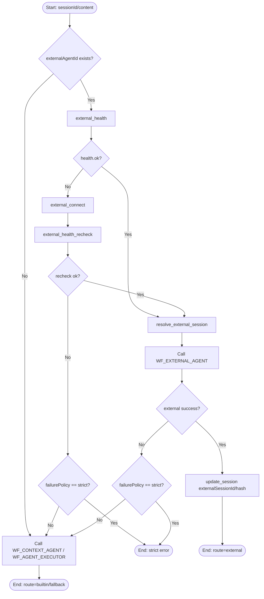

### A02 `WF_AGENT_EXECUTOR`

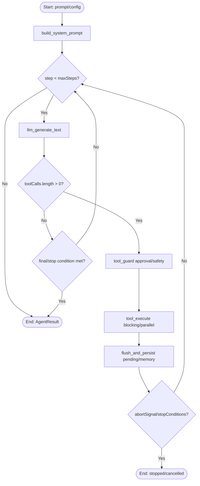

### A03 `WF_CONTEXT_AGENT`

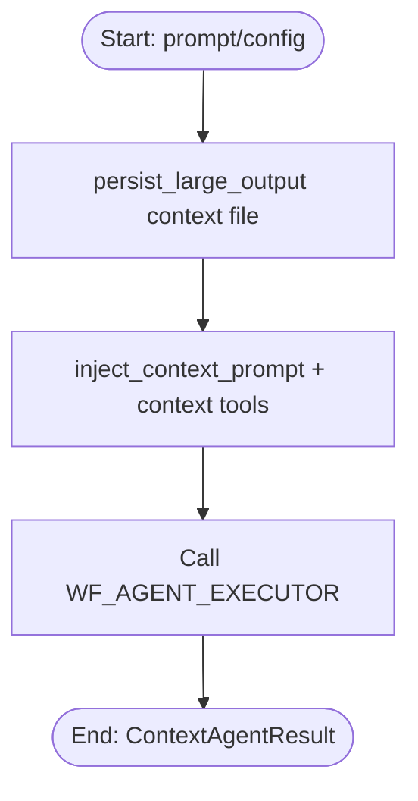

### A04 `WF_AGENT_LOOP`

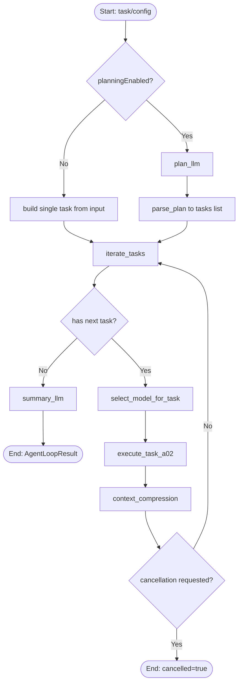

### A05 `WF_SUBAGENT_SINGLE`

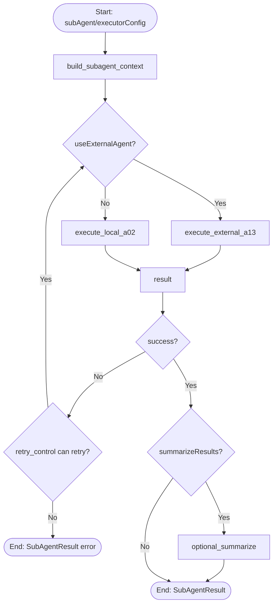

### A06 `WF_SUBAGENT_PARALLEL`

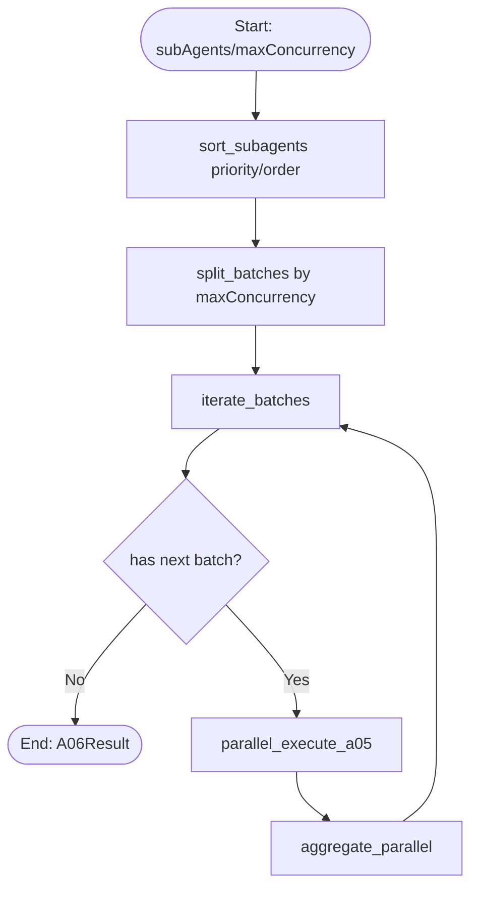

### A07 `WF_SUBAGENT_SEQUENTIAL`

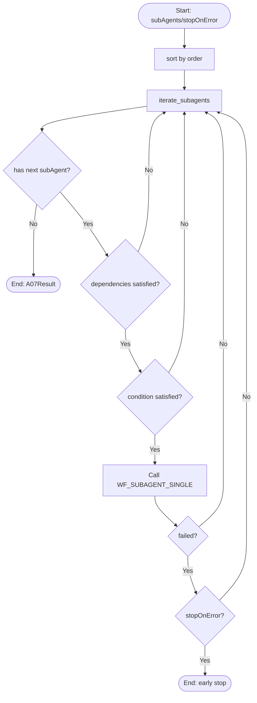

### A08 `WF_SUBAGENT_DAG`

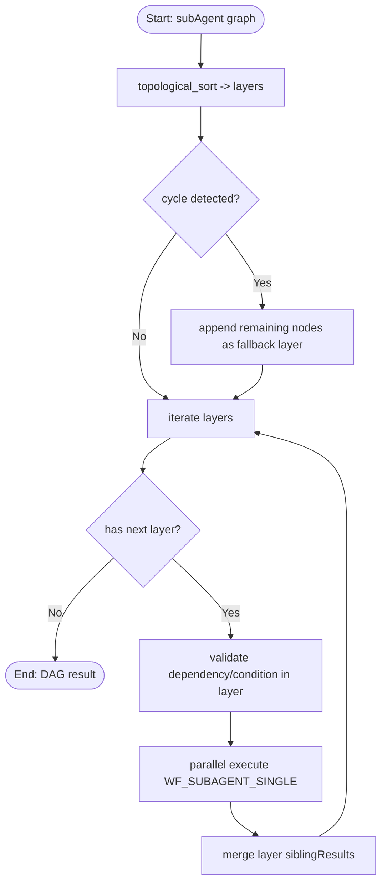

### A09 `WF_ORCHESTRATOR`

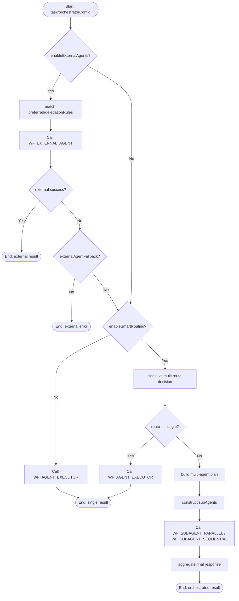

### A10 `WF_TEAM`

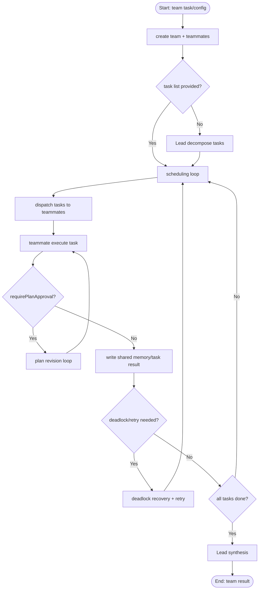

### A11 `WF_BACKGROUND_QUEUE`

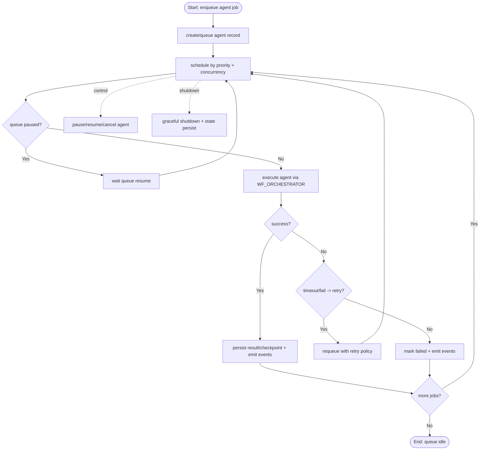

### A12 `WF_BRIDGE_DELEGATION`

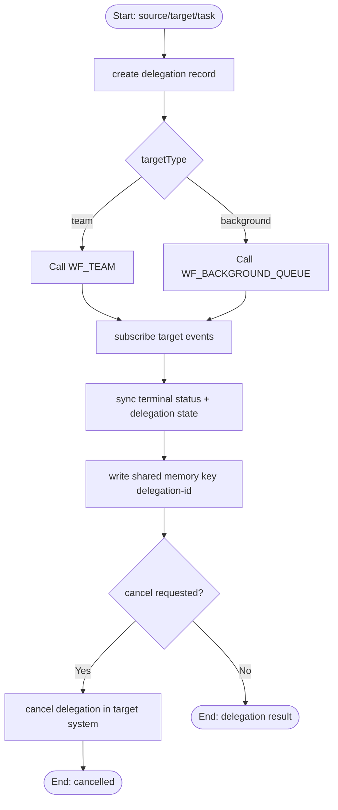

### A13 `WF_EXTERNAL_AGENT`

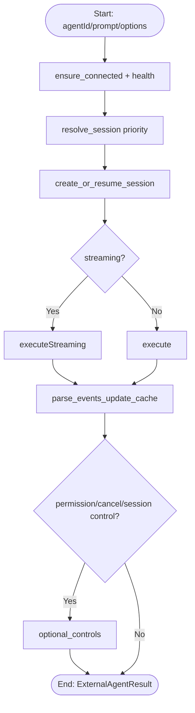

### A14 `WF_SCHEDULER_AGENT_TASK`

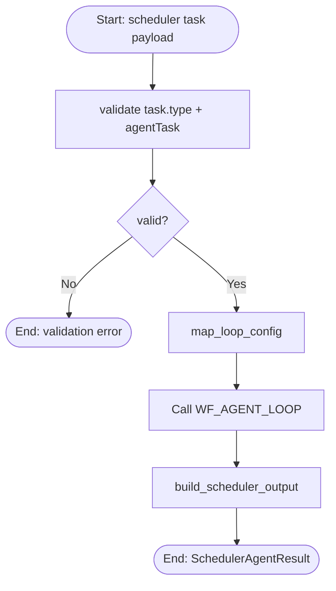

### A15 `WF_PLUGIN_AGENT_GATEWAY`

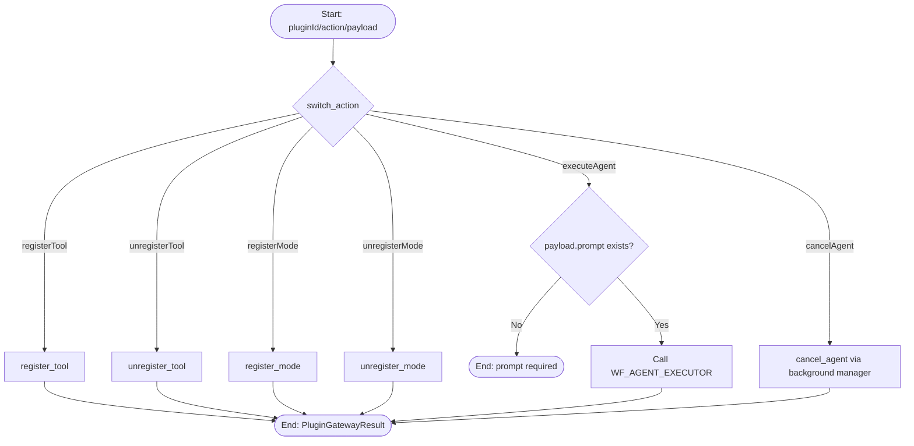

### A16 `WF_TEAM_TOOLS`

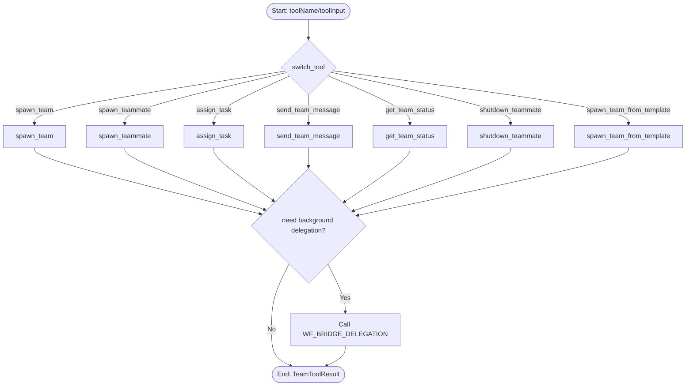

### A17 `WF_EXTERNAL_AGENT_BOOTSTRAP`

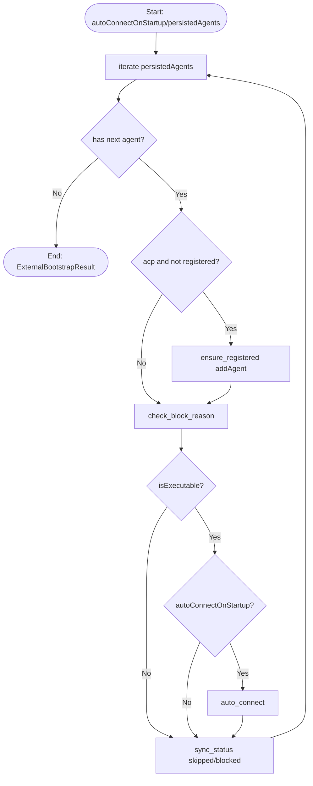

### A18 `WF_BACKGROUND_EVENT_PROJECTION`

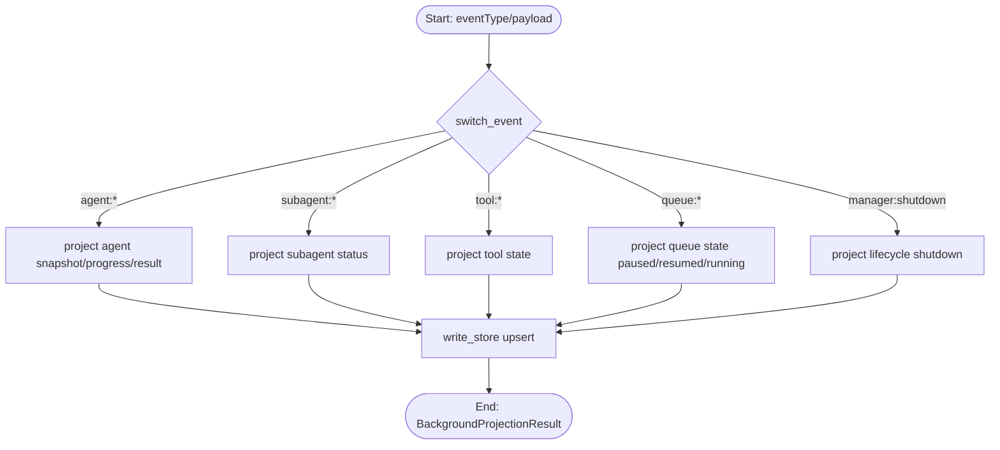
